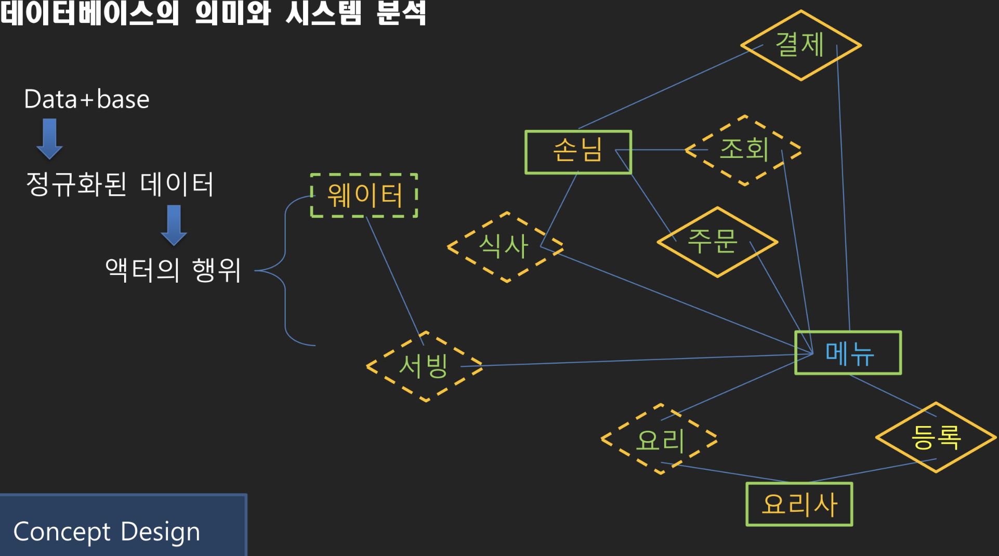

# ERD

## **<데이터 베이스 ERD** Entity Relationship Diagra&#x6D;**>**&#x20;

&#x20;

액터의 행위 분석

.png>)&#x20;

추가나 삭제가 필요한 데이터 선별

&#x20;  &#x20;


asdf네모는 : 주체, 세모는 행위 \[태이블] | 동그라미는 데이터 \[엔티티] | PrimaryKey는 유일 값 | ForeignKey는 참조 값 |




&#x20;

네모1가 여러개의 네모2를 세모 할 수 있다.

네모2가 여러개의 네모1를 세모 할 수 있다. 이러면 N대 N

부모와 관계 확인

[https://app.diagrams.net/](https://app.diagrams.net/) ERD그리기 쉬운 툴


네모 : 주체

마름모 : 행위

데이터 : 자체 속성 + 참조속성ex) 주문의 데이터 : 일자 수량 금액 / 회원 메뉴

디스플레이(메인페이지)는 제일 나중에 만드는 것





### 키의 설정

<figure><figcaption></figcaption></figure>

주문의 경우 데이터를 식별자로 쓸 수 있다면 사진과 같이 Private key로 올린다.

<figure><figcaption></figcaption></figure>

하지만 같은 고객이 재주문한다면 회원아이디와 주문아이디로 구분할 수 없기 때문에 대리로 식별자를 사용해야한다.



d

